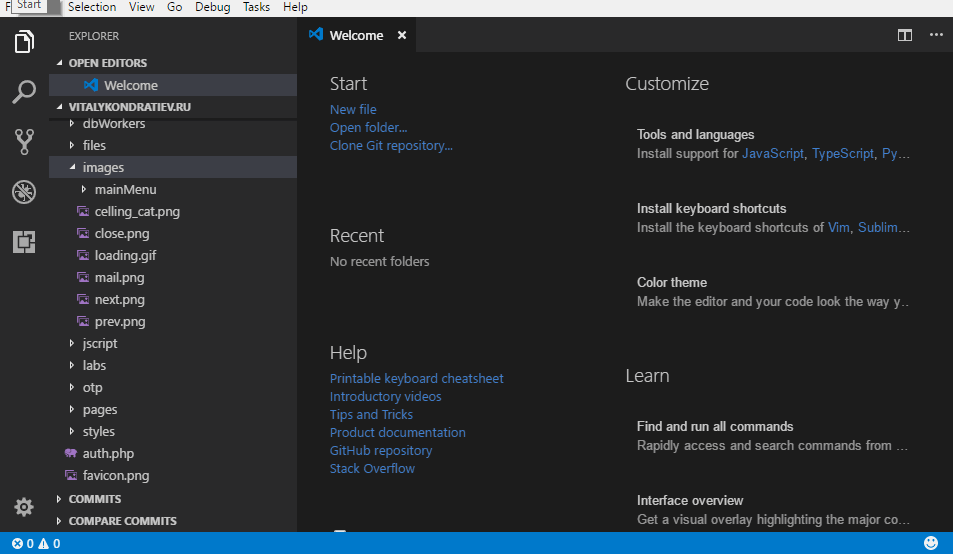
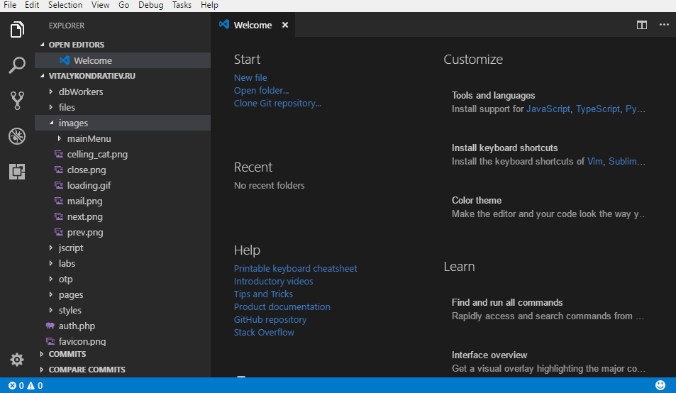
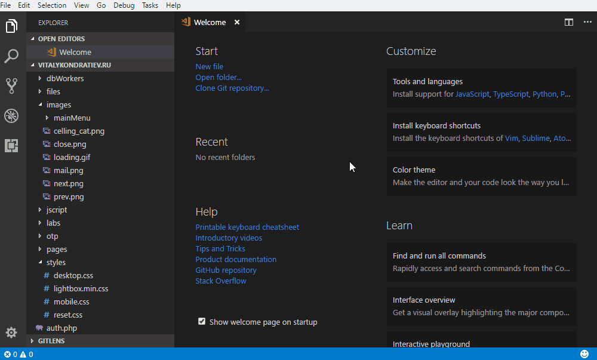

# SmartSSH-SMBA

[](https://marketplace.visualstudio.com/items?itemName=smartssh.smartssh)

This extension allows you to open an SSH connection in the integrated terminal and supports SMB path mapping to automatically switch directories.

## Features

- SSH 连接管理和自动目录切换
- SMB 路径映射支持
- 自定义命令和工作区命令
- 终端路径识别和快速文件打开
- 编译错误输出导航支持

## 终端路径识别和文件打开

扩展支持在终端中识别和打开以下格式的路径：

### 支持的路径格式

1. 标准 Unix 路径
   - 绝对路径：`/path/to/file.cpp`
   - 带行号：`/path/to/file.cpp:45`
   - 带行号和列号：`/path/to/file.cpp:45:10`
   - 以 `~/` 开头的路径：`~/projects/file.cpp`

2. CMake 错误输出
   - 标准格式：`file.cpp(45): error message`
   - 带列号：`file.cpp(45,10): error message`

3. Make/GCC 错误输出
   - 标准格式：`file.cpp:45: error: message`
   - 相对路径：`../src/file.cpp:45: error: message`
   - 带列号：`file.cpp:45:10: error: message`

4. 相对路径
   - 当前目录：`./file.cpp`
   - 上级目录：`../file.cpp`
   - 带行号：`../file.cpp:45`

### 文件打开逻辑

当点击终端中的路径时，扩展会按以下顺序尝试打开文件：

1. 如果配置了 SMB 映射：
   - 尝试将远程路径转换为本地路径
   - 如果转换成功且文件存在，直接打开文件

2. 如果是相对路径：
   - 尝试基于当前工作区解析完整路径
   - 如果文件存在，直接打开

3. 如果上述方法失败：
   - 提取文件名和行号信息
   - 在工作区中搜索匹配的文件
   - 如果找到多个匹配项，显示选择列表
   - 如果没有找到，打开 VS Code 的文件搜索框

### 文件定位

- 如果路径包含行号，打开文件后会自动定位到指定行
- 如果同时包含列号，光标会定位到指定列
- 对于在工作区中的文件夹，会在资源管理器中显示并选中

## How to use

### Open terminal from server list

- Open the Command Palette (usually `F1` or `Ctrl+Shift+P`).  
- Select the command `SmartSSH-SMBA: 打开SSH连接`.  
- Select a server from the list.



### Fast open terminal

- Open workspace with project mapped to server
- Open any project file or go to already opened editor tab  
- Click on "Open SSH on \<servername>" button



### SSH port forwarding

- Open the Command Palette (usually `F1` or `Ctrl+Shift+P`).  
- Select the command `SmartSSH-SMBA: SSH Port Forwarding`.  
- Select a forwarding type from: `Local to remote` (-L), `Local to remote` (-R), `SOCKS` (-D), `Recently used` (if exists saved arguments).  
- Enter the required parameters on request.  
- (Optionally) You can save your selections for faster port forwarding in the future.



### SMB path mapping

配置 SMB 映射，扩展会自动将本地工作区路径映射到远程服务器上的对应路径。您可以配置多个映射关系，例如：

```json
{
  "smartssh-smba.config": {
    "serverList": [
      {
        "name": "开发服务器",
        "host": "example.com",
        "username": "user",
        "smbMappingList": [
          {
            "localPath": "C:\\Projects\\WebApp",
            "remotePath": "/home/user/projects/webapp"
          },
          {
            "localPath": "D:\\Documents\\Configs",
            "remotePath": "/etc/myapp"
          }
        ]
      }
    ]
  }
}
```

每个服务器可以配置多个 SMB 映射，每个映射包含：
- `localPath`: 本地 SMB 共享挂载路径
- `remotePath`: 服务器上对应的远程路径

当您从本地工作区打开 SSH 连接时，扩展会：
1. 自动检测当前工作区路径
2. 查找匹配的 SMB 映射
3. 切换到远程服务器上的对应目录

> **注意**: 为了向后兼容，扩展仍然支持旧版的单一 `smbMapping` 配置，但建议使用新的 `smbMappingList` 配置以支持多路径映射。

#### 映射示例

1. 单个项目映射：
```json
{
  "smbMappingList": [
    {
      "localPath": "C:\\Projects\\MyApp",
      "remotePath": "/home/user/projects/myapp"
    }
  ]
}
```

2. 多项目映射：
```json
{
  "smbMappingList": [
    {
      "localPath": "C:\\Projects\\Frontend",
      "remotePath": "/var/www/html"
    },
    {
      "localPath": "D:\\Backend",
      "remotePath": "/opt/backend"
    }
  ]
}
```

3. 使用 `~/` 的相对路径映射：
```json
{
  "smbMappingList": [
    {
      "localPath": "C:\\Projects",
      "remotePath": "~/projects"
    }
  ]
}
```

#### 路径映射规则

1. 路径匹配采用最长匹配原则，即会选择与当前路径最匹配的映射
2. 本地路径不区分大小写（Windows 特性）
3. 远程路径区分大小写（Unix/Linux 特性）
4. 支持使用 `~/` 表示远程用户主目录
5. 如果没有找到匹配的映射，但配置了 `path`，则使用配置的 `path`

#### 调试提示

如果路径映射不生效，请检查：
1. 本地路径格式是否正确（使用反斜杠 `\` 或正斜杠 `/`）
2. 远程路径格式是否正确（使用正斜杠 `/`）
3. 确保本地路径实际存在且可访问
4. 确保远程路径存在且有访问权限

## Requirements
  
You should still have an ssh agent, not necessarily that it is available in the entire system. it is important that it is accessible from the integrated VSCode terminal.

## Settings (for servers)

You can use ready-made config file from this extensions (if you use):

- ftp-simple ([see info about configuring](https://marketplace.visualstudio.com/items?itemName=humy2833.ftp-simple#user-content-config-setting-example), servers with `"type": "sftp"` only).

Or you can use extension settings simply add `smartssh-smba.config` directive.

## Extension settings

### 配置结构

从版本 X.X.X 开始，SmartSSH-SMBA 使用新的配置结构。所有全局配置都整合到 `smartssh-smba.config` 下，包括：

- `serverList` - 服务器列表
- `customCommands` - 全局自定义命令
- `showHostsInPickLists` - 是否在选择列表中显示主机名
- `enableLocalCommands` - 是否启用工作区

工作区（工作区特定）仍保留在 `smartssh-smba.localCommands` 下。

#### smartssh-smba.config

- Type: `Object`
- Default: 
```json
{
  "showHostsInPickLists": false,
  "serverList": [],
  "customCommands": [],
  "enableLocalCommands": true
}
```

包含所有全局配置的对象。

#### smartssh-smba.config.serverList

- Type: `Array`
- Default: `[]`

您可以在此参数中描述服务器配置，作为对象数组。  
服务器对象参数：  

- **name** _(string)_* - 服务器名称（如果 `showHostsInPickLists` 为 `false`，则显示在选择列表中）。  
- **host** _(string)_* - 服务器主机名。
- **port** _(number)_ - SSH 端口。
- **username** _(string)_* - 用于身份验证的用户名。
- **password** _(string)_ - 用于身份验证的密码。
- **privateKey** _(string)_ - 包含私钥文件路径的字符串。
- **path** _(string)_ - 用于在服务器连接后更改目录。
- **agent** _(boolean)_ - 是否使用 SSH 代理。
- **initCommands** _(array)_ - 指定将在会话开始时执行的初始化命令。
- **customCommands** _(array)_ - 服务器特定的自定义命令列表。
- **smbMappingList** _(array)_ - SMB 映射配置列表，用于自动目录切换。
  - **localPath** _(string)_ - 本地 SMB 共享挂载路径。
  - **remotePath** _(string)_ - 服务器上对应的远程路径。

配置示例：

```json
{
  "smartssh-smba.config": {
    "serverList": [
      {
        "name": "开发服务器",
        "host": "example.com",
        "port": 22,
        "username": "user",
        "privateKey": "D:\\id_rsa",
        "path": "/var/www",
        "agent": true,
        "initCommands": [
          "echo '正在加载开发环境...'",
          "source ~/.profile"
        ],
        "customCommands": [
          {
            "name": "启动服务",
            "command": "npm start",
            "description": "启动开发服务器"
          },
          {
            "name": "查看日志",
            "command": "tail -f logs/app.log",
            "description": "实时查看应用日志"
          }
        ],
        "smbMappingList": [
          {
            "localPath": "C:\\Projects\\Frontend",
            "remotePath": "/var/www/html"
          },
          {
            "localPath": "D:\\Workspace\\Config",
            "remotePath": "/etc/myapp"
          }
        ]
      }
    ]
  }
}
```

> **注意**: 为了向后兼容，扩展仍然支持旧版的单一 `smbMapping` 配置，但建议使用新的 `smbMappingList` 配置以支持多路径映射。同样地，旧版的 `customCommands` 字符串数组格式仍然支持，但建议使用新的对象数组格式以支持更多功能。

#### 命令配置说明

1. **初始化命令** (`initCommands`)
   - 在 SSH 连接建立后自动执行
   - 可以是字符串或命令对象
   - 按数组顺序依次执行

2. **自定义命令** (`customCommands`)
   - 可以通过右键菜单或命令面板执行
   - 支持简单字符串格式或完整对象格式
   - 对象格式包含：
     - `name`: 命令名称
     - `command`: 要执行的命令
     - `description`: 命令描述（可选）

命令配置示例：
```json
{
  "initCommands": [
    "cd /var/www",
    {
      "command": "source ~/.nvm/nvm.sh",
      "description": "加载 NVM 环境"
    }
  ],
  "customCommands": [
    {
      "name": "部署",
      "command": "./deploy.sh",
      "description": "部署应用到生产环境"
    },
    {
      "name": "重启服务",
      "command": "sudo systemctl restart myapp",
      "description": "重启应用服务"
    }
  ]
}