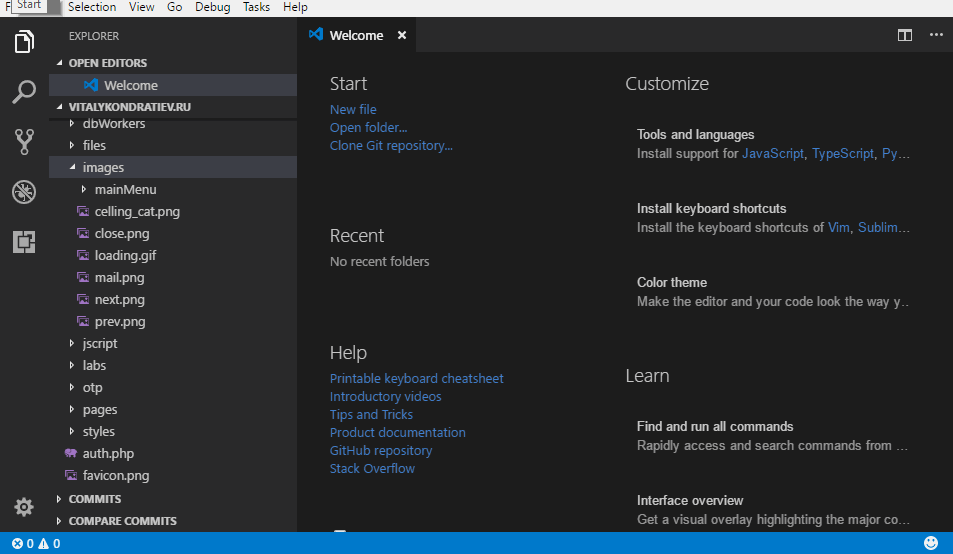
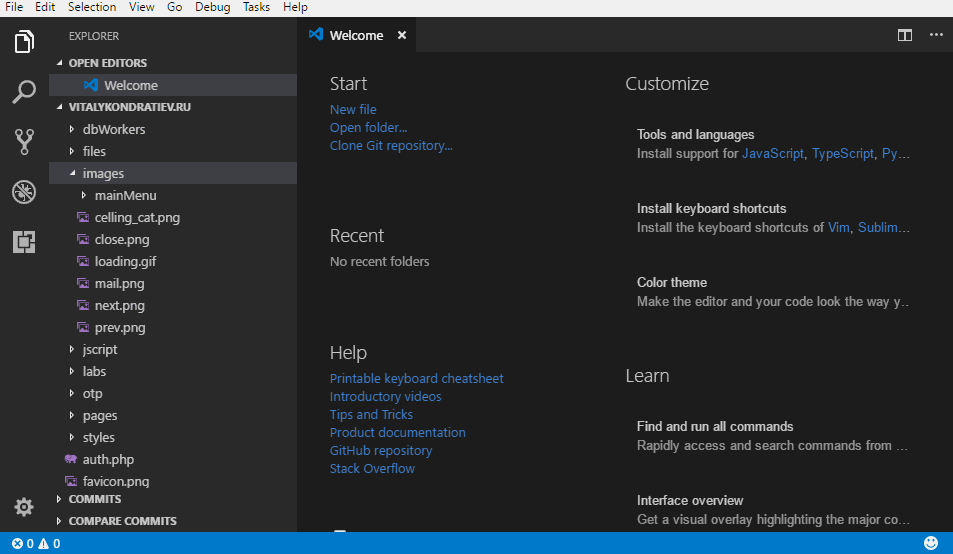
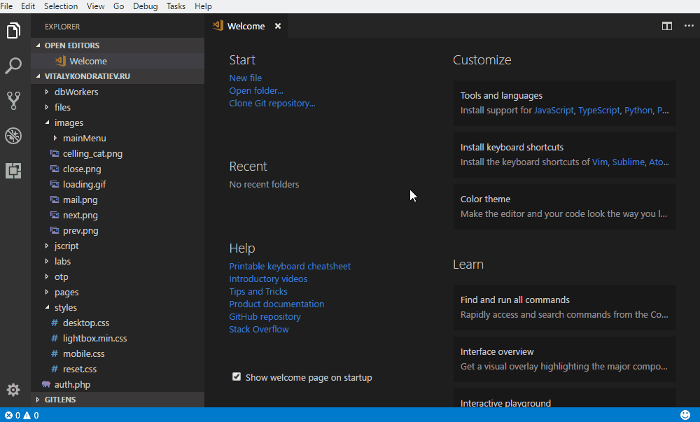
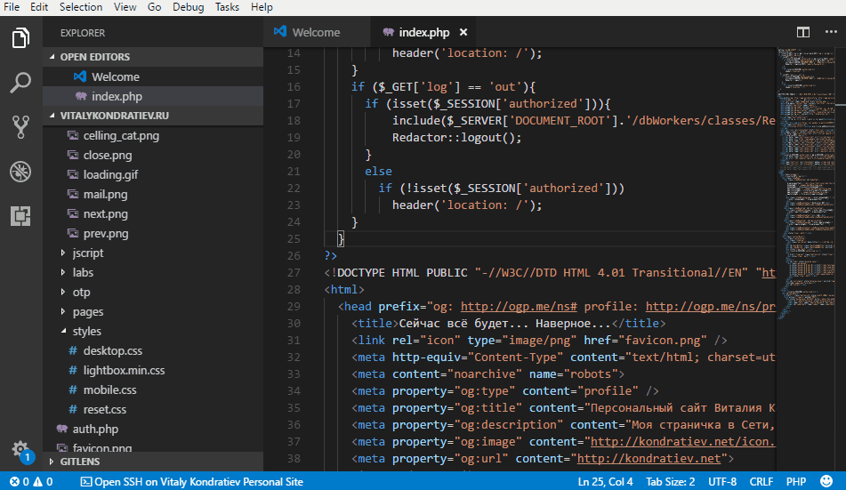

# SmartSSH-SMBA

[](https://marketplace.visualstudio.com/items?itemName=smartssh.smartssh)

This extension allows you to open an SSH connection in the integrated terminal and supports SMB path mapping to automatically switch directories.

## Features

You can use configurations from another extensions (e.g. ftp-simple)  
The connection opens in a new instance of the integrated terminal.  
SSH port forwarding.

## How to use

### Open terminal from server list

- Open the Command Palette (usually `F1` or `Ctrl+Shift+P`).  
- Select the command `SmartSSH-SMBA: 打开SSH连接`.  
- Select a server from the list.



### Fast open terminal

- Open workspace with project mapped to server
- Open any project file or go to already opened editor tab  
- Click on "Open SSH on \<servername>" button



### SSH port forwarding

- Open the Command Palette (usually `F1` or `Ctrl+Shift+P`).  
- Select the command `SmartSSH-SMBA: SSH Port Forwarding`.  
- Select a forwarding type from: `Local to remote` (-L), `Local to remote` (-R), `SOCKS` (-D), `Recently used` (if exists saved arguments).  
- Enter the required parameters on request.  
- (Optionally) You can save your selections for faster port forwarding in the future.



### SMB path mapping

Configure SMB mapping, and the extension will automatically map your local workspace path to the corresponding path on the remote server. For example:

- Local path: `C:\Projects\MyApp`
- Remote path: `/home/user/projects/myapp`

When you open an SSH connection from your local workspace, the extension will automatically switch to the corresponding directory on the remote server.

To add a server, see Settings section.

## Requirements
  
You should still have an ssh agent, not necessarily that it is available in the entire system. it is important that it is accessible from the integrated VSCode terminal.

## Settings (for servers)

You can use ready-made config file from this extensions (if you use):

- ftp-simple ([see info about configuring](https://marketplace.visualstudio.com/items?itemName=humy2833.ftp-simple#user-content-config-setting-example), servers with `"type": "sftp"` only).

Or you can use extension settings simply add `smartssh-smba.config` directive.

## Extension settings

### 配置结构

从版本 X.X.X 开始，SmartSSH-SMBA 使用新的配置结构。所有全局配置都整合到 `smartssh-smba.config` 下，包括：

- `serverList` - 服务器列表
- `customCommands` - 全局自定义命令
- `showHostsInPickLists` - 是否在选择列表中显示主机名
- `enableLocalCommands` - 是否启用本地命令

本地命令（工作区特定）仍保留在 `smartssh-smba.localCommands` 下。

#### smartssh-smba.config

- Type: `Object`
- Default: 
```json
{
  "showHostsInPickLists": false,
  "serverList": [],
  "customCommands": [],
  "enableLocalCommands": true
}
```

包含所有全局配置的对象。

#### smartssh-smba.config.serverList

- Type: `Array`
- Default: `[]`

您可以在此参数中描述服务器配置，作为对象数组。  
服务器对象参数：  

- **name** _(string)_* - 服务器名称（如果 `showHostsInPickLists` 为 `false`，则显示在选择列表中）。  
- **host** _(string)_* - 服务器主机名。
- **port** _(number)_ - SSH 端口。
- **username** _(string)_* - 用于身份验证的用户名。
- **password** _(string)_ - 用于身份验证的密码。
- **privateKey** _(string)_ - 包含私钥路径的字符串。
- **project**  _(object)_ - 指定本地工作区路径和服务器根路径，用于快速终端打开。
- **path** _(string)_ - 用于在服务器连接后更改目录。
- **customCommands** _(array of strings)_ - 指定将在会话开始时执行的自定义命令
- **smbMapping** _(object)_ - SMB 映射配置，用于自动目录切换
  - **localPath** _(string)_ - 本地 SMB 共享挂载路径
  - **remotePath** _(string)_ - 服务器上对应的远程路径

例如：

```json
{
  "smartssh-smba.config": {
    "serverList": [
      {
        "name": "Example server",
        "host": "example.com",
        "port": 22,
        "username": "user",
        "privateKey": "D:\\id_rsa",
        "project": {
          "D:/projects/project": "/home/user/project",
          "D:/projects/yet_another_project": "/home/user/yet_another_project"
        },
        "path": "/",
        "customCommands": [
          "pwd"
        ],
        "smbMapping": {
          "localPath": "C:\\Projects",
          "remotePath": "/home/user/projects"
        }
      }
    ],
    "showHostsInPickLists": false,
    "customCommands": [
      {
        "name": "列出文件",
        "command": "ls -la",
        "description": "列出当前目录下的所有文件和文件夹"
      },
      {
        "name": "查看项目状态",
        "command": "git status",
        "description": "查看 Git 仓库状态"
      }
    ],
    "enableLocalCommands": true
  }
}
```

#### smartssh-smba.config.customCommands

- Type: `Array`
- Default: `[]`

指定将在会话开始时执行的自定义命令。  
例如：

```json
{
  "smartssh-smba.config": {
    "customCommands": [
      {
        "name": "列出文件",
        "command": "ls -la",
        "description": "列出当前目录下的所有文件和文件夹"
      },
      {
        "name": "查看项目状态",
        "command": "git status",
        "description": "查看 Git 仓库状态"
      }
    ]
  }
}
```



#### smartssh-smba.config.showHostsInPickLists

- Type: `Boolean`
- Default: `false`

在选择列表中显示用户名和主机名，而不是服务器名称。  
例如：

```json
{
  "smartssh-smba.config": {
    "showHostsInPickLists": true
  }
}
```

#### smartssh-smba.config.enableLocalCommands

- Type: `Boolean`
- Default: `true`

启用或禁用本地命令功能。  
例如：

```json
{
  "smartssh-smba.config": {
    "enableLocalCommands": false
  }
}
```

#### smartssh-smba.localCommands

- Type: `Array`
- Default: `[]`

指定工作区特定的本地命令。  
例如：

```json
{
  "smartssh-smba.localCommands": [
    {
      "name": "构建项目",
      "command": "npm run build",
      "description": "构建当前项目"
    },
    {
      "name": "启动开发服务器",
      "command": "npm run dev",
      "description": "启动开发服务器"
    }
  ]
}
```

## Roadmap

Add the ability to work with an external terminal.  
Open SSH connections in Putty.  
And a few more ~~secret (before their release)~~ features... ).

## Special thanks

[eduardbadillo](https://github.com/eduardbadillo)  
Added ability to use different port in ssh connections _([pull request](https://github.com/VitalyKondratiev/vscode-smartssh/pull/3) merged in version 0.1.2)_

## Feedback

I want to make a really useful extension, if you find a bug, please create an issue at github.  
If you have suggestions to the functional, then write to the same.  
And also if it's not difficult for you, leave a comment in the marketplace.

GitHub repository: [https://github.com/Crafter-feng/smartssh-smba](https://github.com/Crafter-feng/smartssh-smba)
